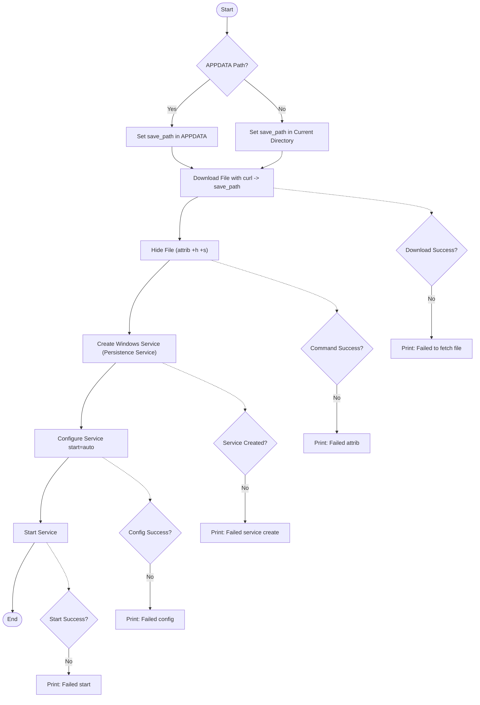

# MITRE-ATT-CK-Persistence-Service
Windows persistence techniques. The script illustrates MITRE ATT&amp;CK tactics including file deployment, hiding files, creating and configuring a Windows service.
 &nbsp;

# Deployment Flowchart

